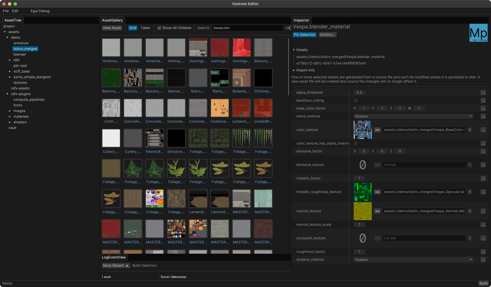

# Hydrate

Hydrate is an asset pipeline and game data authoring framework.

[Take a Quick Tour](docs/quick-tour/quick-tour.md)

[Documentation](docs/index.md)



## Running the Demo

```
git clone https://github.com/aclysma/hydrate.git
cd hydrate/demo-editor
cargo run
After it launches, click build in the bottom right and close the editor
cd ../demo-game
cargo run
```

## Project Status

This project should be considered experimental and unsupported. My primary goal in
open-sourcing this project is to share *ideas*. I would love to see other projects
learn from this project and make something even better.

I will happily discuss the high-level design decisions for this project and rationale
for choosing certain tradeoffs, but I probably won't be able to devote much time
to support. I might arbitrarily not take a PR simply because it is not a feature
I'm personally interested in.

The demo code in this repository and [rafx](https://github.com/aclysma/rafx)'s usage of this crate are the best
examples to look at for how hydrate works.

## License

Licensed under either of

* Apache License, Version 2.0, ([LICENSE-APACHE](LICENSE-APACHE) or http://www.apache.org/licenses/LICENSE-2.0)
* MIT license ([LICENSE-MIT](LICENSE-MIT) or http://opensource.org/licenses/MIT)

at your option.

### Upstream Dependencies
Fonts in this repository from upstream sources may have their own license, usually OFL

Some dependencies may be licensed under other terms. These licenses include "ISC", "CC0-1.0", "BSD-2-Clause",
"BSD-3-Clause", and "Zlib". This is validated on a best-effort basis in every CI run using cargo-deny.

### Acknowledgements

Hydrate is inspired by [Distill](https://github.com/amethyst/distill) and 
borrows many of the ideas from that project.

## Contribution

Unless you explicitly state otherwise, any contribution intentionally
submitted for inclusion in the work by you, as defined in the Apache-2.0
license, shall be dual licensed as above, without any additional terms or
conditions.

See [LICENSE-APACHE](LICENSE-APACHE) and [LICENSE-MIT](LICENSE-MIT).
