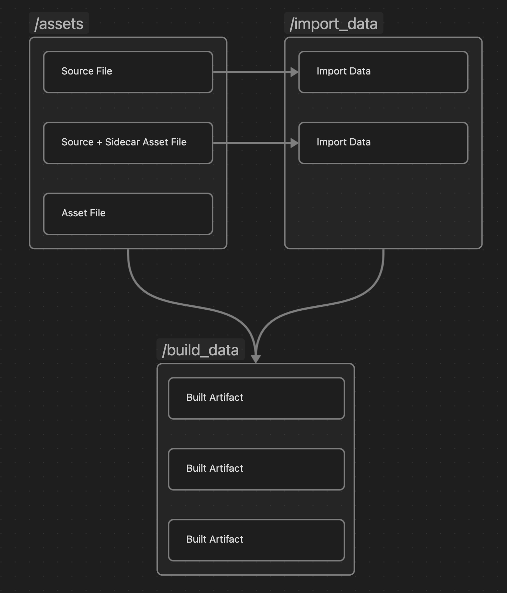

# Assets, Import Data, and Artifacts

The most fundamental unit of authored data is an **Asset**. Assets can be thought of
as container of property/value pairs. They can either be created/modified within an
editor or imported from a source file.

A **source file** is any file that is imported. Examples include textures (`.png`, `.dds`)
and meshes (`.obj`, `.fbx`).

When source files are imported, they create one or more assets. Commonly, the asset will
have **Import Data** associated with it. Import data cannot exist without being attached to a
particular asset. This import data cannot be edited directly, but the asset may have properties
that affect how the import data is built.

In the editor, all assets are loaded into memory at all times. This remains tractable because
bulk data is stored as import data, not in the asset itself. Import data is requested on-demand
when building assets.

The built form of an asset is an **artifact**. A single artifact could represent data defined
across many assets, or a single asset could produce many artifacts. While not explicitly
supported currently, it's expected that the same data may need to be exported in slightly
different forms for different platforms. In this case, there would be an artifact (or set
of artifacts) produced per-platform.

