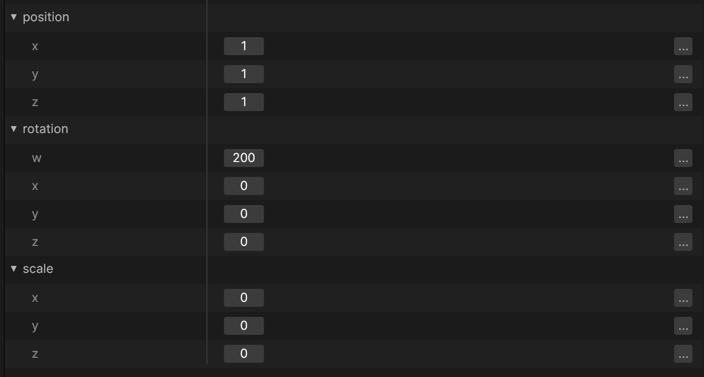
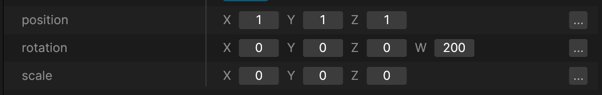
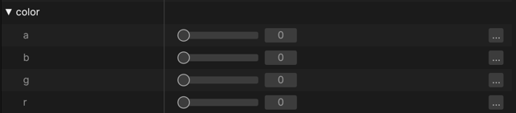

# Custom Inspectors

In some cases, you may want greater control in how a record is presented to
end-users in the editor. For example, a Vec3 may wish to put all fields in a single
line of the property editor, or draw a color picker rather than numeric fields.

To control presentation of a record in the property editor, create a custom inspector.
An example of this is provided in the demo-editor crate.

## Vec3 Example

### Without Custom Inspector

### With Custom Inspector

## Color Example

### Without Custom Inspector

### With Custom Inspector

