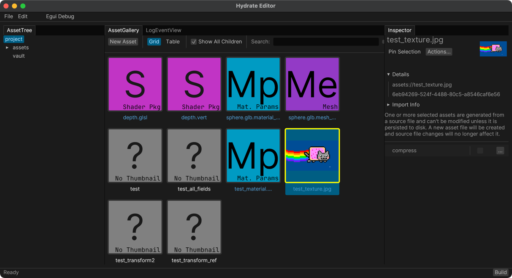
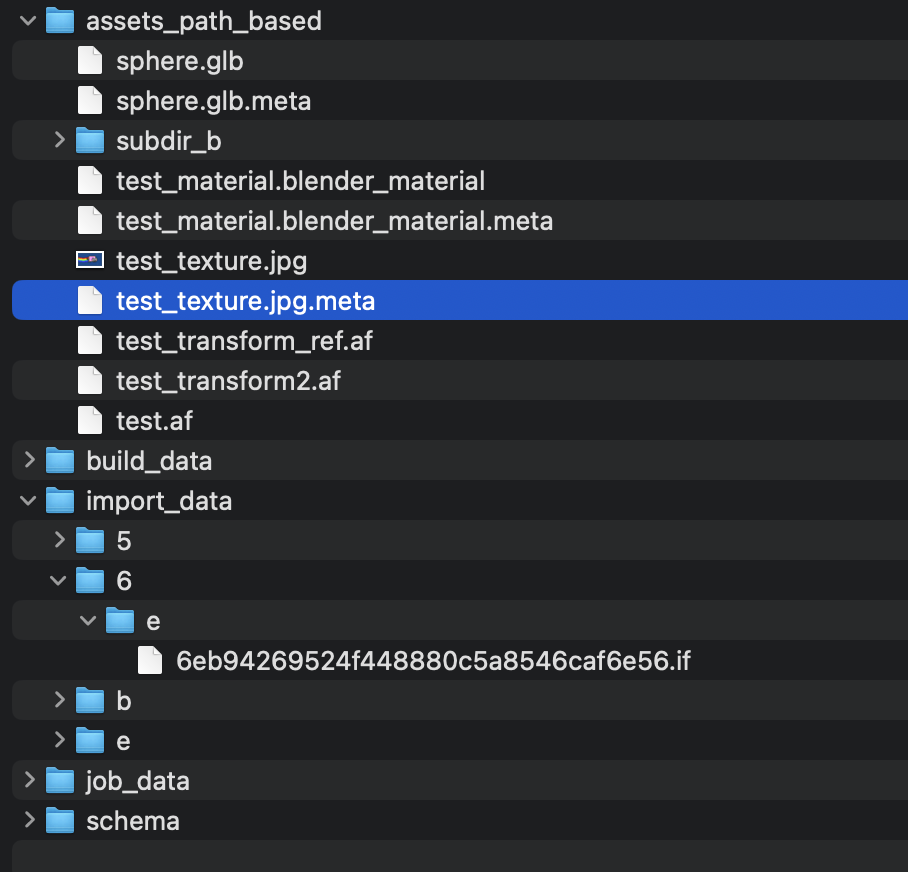
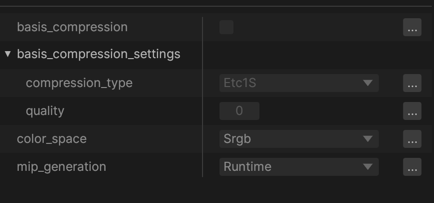
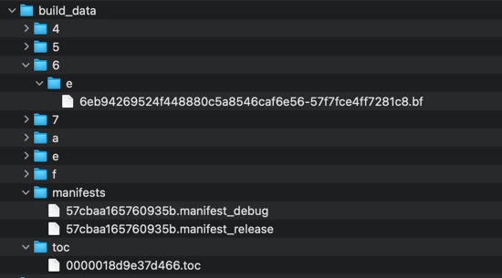

# Technical Data Flow

To illustrate how hydrate works internally, an example of importing,
modifying, building, and loading some game data is given below. We will use
the simple example of a texture and a more complicated example of a mesh.

## Importing a Texture

Quite possibly the first kind of data you'd want to get loading in a game project
is an image. Let's assume you already have the file in a format such as .png or .tif.

With hydrate, you could import it in one of two ways:
- Store the image file in a path-based asset source
- Drag and drop it into the editor

In this example, we will place the file in a path-based asset source. When you load
the editor, the image will be imported automatically.



Both a .meta file and an import file (.if) will be produced.



#### Example Meta File (test_texture.meta)

The meta file exists to ensure a stable ID on future re-imports.

```json
{
  "importables": {
    "": {
      "id": "6eb94269-524f-4488-80c5-a8546caf6e56",
      "persisted": false
    }
  }
}
```

The import file contains the actual image data. Import data is stored separately 
from asset data. Some teams may want to only commit source and asset data to
source control. Additionally, in the editor, all assets are loaded at all times,
but import data is only loaded to generate thumbnails or build assets.

### Modifying how the Asset is Processed

Once imported, you may want to specify some additional options such as compression
settings or mipmap generation settings. **In order to modify an asset automatically
imported from a path-based asset source, you must "persist" it.** This means:
 - An asset file is produced to store edited settings.
 - Any changes to the source file will no longer affect the asset settings.



#### Example Asset File (test_texture.meta)

This file is a container of properties authored in the editor and supports schema migration.

```json
{
  "id": "6eb94269-524f-4488-80c5-a8546caf6e56",
  "name": "test_texture.jpg",
  "parent_dir": null,
  "root_schema": "ccb4cc38-2bf3-0ec8-4928-c470615e80be",
  "schema_name": "GpuImageAsset",
  "import_info": {
    "importer_id": "e7c83acb-f73b-4b3c-b14d-fe5cc17c0fa3",
    "source_file_path": "assets://test_texture.jpg",
    "importable_name": "",
    "file_references": {},
    "source_file_modified_timestamp": "0000000065ca4b18",
    "source_file_size": "0000000000012413",
    "import_data_contents_hash": "9e1e7601d67c5943"
  },
  "build_info": {
    "file_reference_overrides": {}
  },
  "prototype": null,
  "properties": {
    "basis_compression": false
  },
  "schemas": {
    "ccb4cc38-2bf3-0ec8-4928-c470615e80be": "..."
  }
}
```

#### Example Import Data

Import data is stored in binary, but if you open in a text editor you may notice that
the original asset data and an additional "import" object are encoded similarly as json.
While this file *is* binary, and will likely be corrupted if edited by hand, it is at
least somewhat intelligible. This section in particular is interesting. The same
schema and property system is used (so schema migration is supported for import data)
but binary data is stored as an index into the binary data that follows the json segment.

```json
  "root_schema": "a7f3aaf5-9c3f-5acd-164a-15f181c451ed",
  "schema_name": "GpuImageImportedData",
  "properties": {
    "height": 450,
    "image_bytes": 0,
    "width": 800
  },
  <Binary Data>
```

### Building

Assets that exist in hydrate are **built** into artifacts. While many artifacts are a
simple 1:1 relationship with an assets, build steps can read data from an arbitrary
number of assets and produce an arbitrary number of artifacts. For example, an image
could have high mip levels in a separate artifact from lower mip levels, allowing for
a streaming LOD system.

In our simple example, we will assume a single image produces a single artifact.



 - The .bf file contains the actual built artifact data that would be loaded at runtime.
   The filename is the artifact ID and hash of the contents of the build data.
 - The .manifest_debug file is a json file with lots of metadata that is not strictly 
   needed for a shipped game, but is very useful to have in development
 - The .manifest_release file is a more efficient format that only includes data needed
   to load the asset at runtime.
 - The TOC file is a text file with a single hash of the build. The filename is a
   timestamp and the highest-numbered TOC wins.

This representation of build data is a compromise of robustness, debuggability, and
future support:

 - Build data is immutable and does not need to be re-written if the artifact does
   not change
 - The manifest allows looking up anything by hash and is loaded in memory at runtime.
   This allows very basic information about all artifacts to be available, without
   having to load the asset. In particular, this allows artifacts to be looked up
   by name or ID.
 - Monitoring for a new build just requires looking for the latest TOC
 - A reload does not start until the build completes 

A future revision to use something more database-like is completely feasible. In fact
the original plan was to transition this to be stored in something like LMDB. But
performance has not been a problem yet, and it's very convenient to see the build data
on disk.

This data layout was also designed to support build caching and content distribution.
You could image the .bf files stored in redis, minio, or some distributed blob
storage or CDN system. As long as a game has the manifest locally, all build data can
be streamed/loaded as needed, and locally cached.

### Loading

Some example code below:

```rust
let transform_handle: Handle<TransformArtifact> =  
    loader.load_artifact_symbol_name("assets://test_transform2");

// ...

loop {
    loader.update();

    // The artifact, along with dependencies, will be loaded in the background
    // If the asset changes and is rebuilt, it will be reloaded in-game
	if let Some(transform) = transform_handle.artifact(loader.storage()) {  
	    println!("transform loaded {:?}", transform);  
	} else {  
	    println!("transform not loaded");  
	}
}
```

The main steps for loading an artifact are as follows:
 - Determine the UUID of the artifact to load
   - The manifest is in memory and makes this process a simple hashmap lookup.
 - Request metadata of the artifact
   - The head of every artifact file contains a small segment of data with extra
     information about the artifact, such as a list of all artifacts that will need
     to be loaded before loading this artifact
 - Load dependencies
 - Load actual data of the artifact into memory
   - This is the full read of artifact data, could be multiple MBs of data
 - Create the artifact at runtime
   - Hooks are provided to for example, load an image into GPU memory

## Importing a Mesh

This is a more complicated example. I'll mainly highlight the ways this is different
from the simple example:

Let's say you have a GLTF file with a PBR-based mesh. This GLTF file contains:
- Multiple images, for example albedo, normal map, metalness/roughness, etc.
- Multiple materials (that may reference images)
- Multiple stream of vertices
- Meshes that reference the vertex streams and materials

This does not include everything that might exist in a model input format. There could
be animations, multiple LODs, metadata for attaching meshes or particle systems, etc.

It's also entirely possible that the GLTF file references images by path, or includes
a full copy of the image data internally. (See also, .glb files)

### Importing

The process is similar to above, except the .meta file may contain multiple assets.

```json
{
  "importables": {
    "material_Material.001": {
      "id": "5bd71ce5-5ff2-4a92-a89e-f11f2866b5cb",
      "persisted": false
    },
    "mesh_Sphere": {
      "id": "ebfd7cb8-24d3-49ab-a484-09f0b1c78d16",
      "persisted": false
    }
  }
}
```

This will show in the editor as two different assets.

Note that in this case, the importables are named. An importer for any source data
must name all importable units of data uniquely. Each imported asset has its own
asset UUID.

### Building

In this case, multiple artifacts are produced, one for each asset. (This is not
necessarily always true. A single asset could produce multiple artifacts, even 
ignoring support for different artifacts for different platforms.)

```json
{
  "artifacts": [
    {
      "artifact_id": "5bd71ce5-5ff2-4a92-a89e-f11f2866b5cb",
      "build_hash": "502038887873719b",
      "combined_build_hash": "502038887873719b",
      "symbol_name": "assets://sphere.glb.material_Material.001",
      "symbol_hash": "0d84a3187d182ad474116d8c7599fdd1",
      "artifact_type": "90228283-3d7f-4ba8-9e20-6cc2871ad9ff",
      "debug_name": "assets://sphere.glb.material_Material.001"
    },
    {
      "artifact_id": "ebfd7cb8-24d3-49ab-a484-09f0b1c78d16",
      "build_hash": "9e0d90df9c7216d6",
      "combined_build_hash": "9e0d90df9c7216d6",
      "symbol_name": "assets://sphere.glb.mesh_Sphere",
      "symbol_hash": "5301d756c1b7ff904aaa4b3edf0c0efd",
      "artifact_type": "4c888448-2650-4f56-82dc-71ba81f4295b",
      "debug_name": "assets://sphere.glb.mesh_Sphere"
    }
  ]
}
 ```